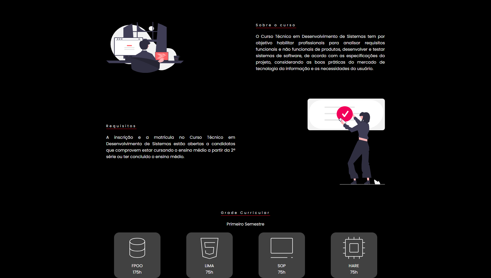
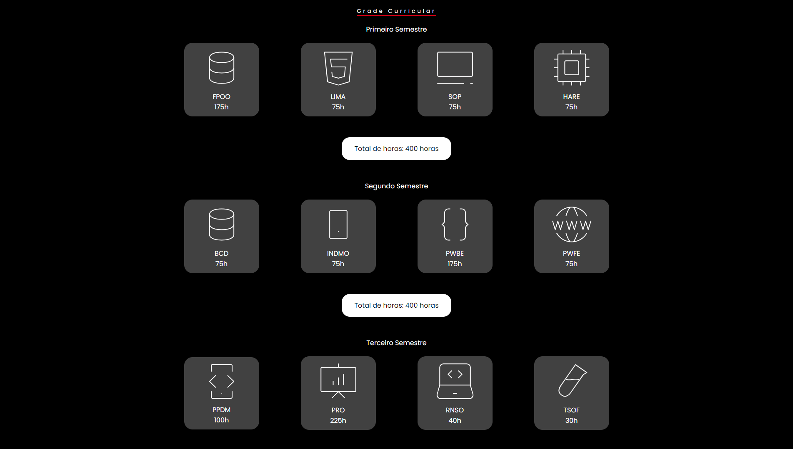
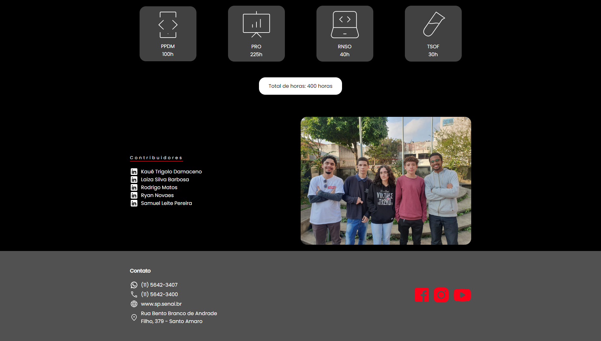
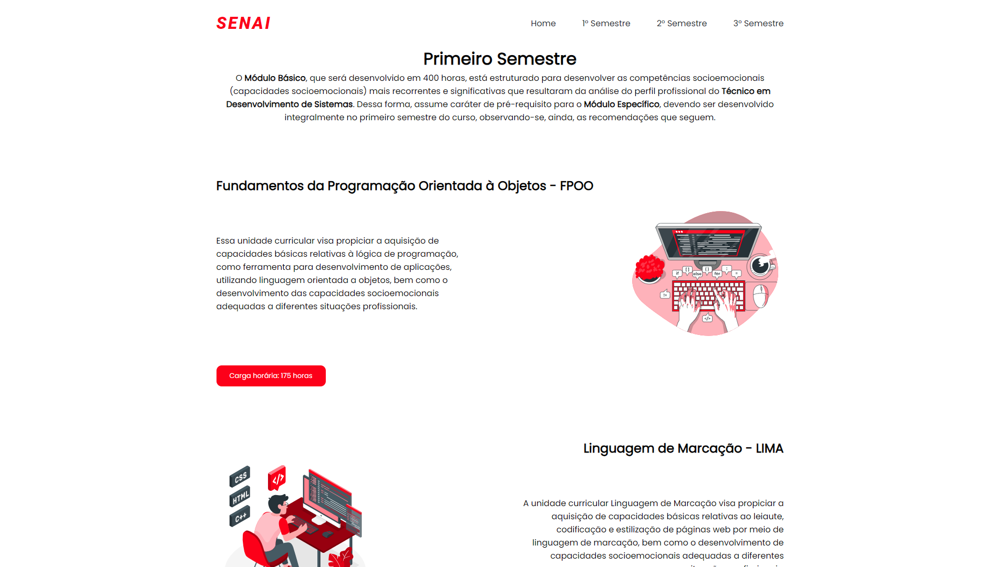

<h1 align="center">Projeto Integrador SENAI Suiço-Brasileira 🏫</h1>

<p align="center">Projeto integrador, solicitado como trabalho final do primeiro semestre do curso Técnico em Análise e Desenvolvimento de Sistemas na instituição SENAI Suíço-Brasileira, com o objetivo de divulgar e promover o curso. 🚀</p>

## Sumário

- [Overview](#overview)
  - [Screenshot](#screenshots)
  - [Links](#links)
- [Sobre o projeto](#sobre-o-projeto)
  - [Tecnologias utilizadas](#tecnologias-utilizadas)
  - [Instalação](#instalação)
- [Autor](#autor)
- [Contribuidores](#contribuidores)

## Overview

### Screenshots

<div align="center">
  <h4>Desktop</h4>
  
  
  
  
  
  
</div>

#### Mobile
<div align="center">
  <h4>Desktop</h4>
</div>

### Links

> URL da Página: [https://projetointegradorsenai.vercel.app](https://projetointegradorsenai.vercel.app)

## Sobre o projeto

### Tecnologias Utilizadas


- HTML Semântico
- CSS
- Flexbox
- Responsividade
- Javascript

### Instalação

Para obter e executar o projeto em seu próprio dispositivo, faça o sequinte:

> Clone o repositório
```bash
git clone https://github.com/ProgrammerAndInvestor/projeto-integrador-SENAI.git
```

> Navegue até o diretório do projeto
```bash
cd projeto-integrador-SENAI
```

> Execute o arquivo principal `index.html`
```bash
index.html
```

## Autor

<p>Samuel Leite Pereira</p>
<a href="https://linkedin.com/in/samuel-leite-pereira">
   
</a>
<a href="https://github.com/ProgrammerAndInvestor">
  
</a>

## Contribuidores

<p>Kauê Trigolo Damaceno</p>
<a href="https://www.linkedin.com/in/kau%C3%AA-trigolo-damaceno-411a11287/">
   
</a>
<a href="https://github.com/kauetrigolo">
  
</a>

<p>Laiza Silva Barbosa</p>
<a href="https://www.linkedin.com/in/laiza-silva-barbosa-1821b7271/">
   
</a>
<a href="https://github.com/LaizaBarbosa">
  
</a>

<p>Rodrigo Cândido Matos</p>
<a href="https://www.linkedin.com/in/rodrigo-matos-38b954287/">
   
</a>
<a href="https://github.com/Rodriguou">
  
</a>

<p>Ryan Novaes</p>
<a href="https://www.linkedin.com/in/ryan-novaes-847532272/">
   
</a>
<a href="https://github.com/ryanNS3">
  
</a>
